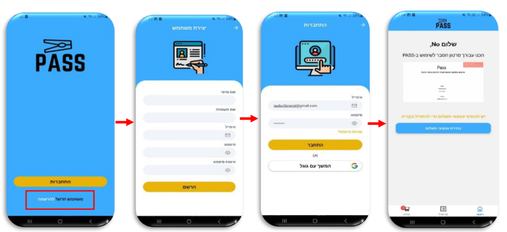

# Pass

Our idea was to solve the issue of queues in clothing stores and for that, we developed an application and hardware that communicate with each other and solve that problem.

## Requirements
- Node.js v12.x or higher
- Expo CLI v6.x or higher
- MongoDB v4.x or higher
- Android Studio for building and running the app on a simulator or device
- Braintree sandbox account: https://www.braintreepayments.com/sandbox

## Try the project
The easiest way to get an impression of the application is to download it via the following APK:
https://drive.google.com/drive/folders/1FtLNCb1c3ubF1y0ZaeNql2jf5mzLiYlu?usp=sharing

## A little peek at the app screens
### Project Video

  

## Architecture
The following diagram describes the Pass server structure according to the MVC (Model-View-Controller) model:

  

- index.js, app.js - the application's main entry point, the main file in which the server is started.

- config- a folder that contains the configuration and initialization files for server-side tools such as the payment service against Braintree, the initialization of the database, and the initialization of the email-sending service.

- middlewares- the folder containing functions used as an "intermediate layer" between the client and the server, the functions perform actions on the client requests/server responses such as checking the integrity of the requests arriving at the server and authentication tests.

- The controller's folder contains functions responsible for handling the logic of the various APIs.

- The routes folder contains functions that link the type of HTTP request (Get, Post, Put, Delete) in combination with the path to the server and a corresponding function from the controllers folder.

- logs- files that contain data for requests that arrived and were handled by the server or errors that resulted from the server running.

- utils - folder containing general utility functions.

- The models folder contains schemas defining the information arrangement in the database.

This diagram describes the division of files into client-side modules according to the structure of a standard project using React Native:

  

  

- App.js - the main file in which all the settings and libraries that run in our application are initialized, here the main UI component of the application is also created and the rest of the components are derived from it.

- screens - the main UI components for each screen in the application, each file is for a different screen.

- components – UI components that are reused on different screens. Each file contains one UI component.

- hooks – auxiliary functions that contain, among other things, functions that interface with the life cycle of projects in React. Each file contains one method.

- utils – general utility functions. Each file contains one method.

- stores – files containing objects used globally in different components and dynamically control the UI components and methods for them.

- api - files that contain all the HTTP requests to the Pass server according to the resources that the Pass server contains when index.js initializes an object that knows how to send the requests and adds additional definitions that are sent with the requests such as HTTP headers such as authorization when it comes to requests for a protected resource and functions that are called before or after making the requests .

## Hardware

3D model of the product shell

Electrical planning

## Built With

- [React Native](https://reactnative.dev/) - A framework for building mobile apps with React
- [Node.js](https://nodejs.org/) - A JavaScript runtime for building server-side applications
- [Expo](https://expo.io/) - An open-source platform for building and deploying mobile apps with JavaScript and React Native
- [Braintree](https://www.braintreepayments.com/) - A payment gateway for securely handling transactions
- [MongoDB](https://www.mongodb.com/) - A document-based database for storing and retrieving data
- [Mongoose](https://mongoosejs.com/) - An Object Data Modeling (ODM) library for MongoDB

## Authors

- **Nadav Buchwalter** 
- **Amit Hemo**

