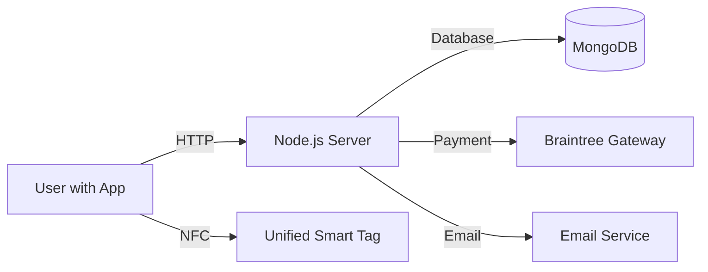

# System Architecture

## Overview

The system follows a standard Client-Server architecture with an additional hardware component (Smart Tag) for physical security interaction. The server follows the MVC (Model-View-Controller) pattern.

## High-Level Diagram

## Technology Stack

### Client (Mobile App)

- **Framework**: React Native (Expo)
- **Language**: JavaScript
- **State Management**: `zustand` (Lightweight state management)
- **API Data Fetching**: `axios` combined with `react-query` (TanStack Query) for async state management.
- **Form Management**: `react-hook-form` for efficient form validation and handling.
- **Key Libraries**:
  - `react-native-hce`: For Host Card Emulation (NFC) to unlock tags.
  - `nativewind`: For TailwindCSS styling.

### Server (Backend)

- **Runtime**: Node.js
- **Framework**: Express
- **Language**: JavaScript
- **Architecture**: MVC (Model-View-Controller)
- **Database**: MongoDB (with Mongoose ODM)
- **Validation**: `zod` for request data validation.
- **Payment Gateway**: Braintree
- **Email Service**: `nodemailer` (Receipts, OTPs, Password Resets).
- **Authentication**:
  - Email/Password or Google OAuth.
  - JWT (Access and Refresh tokens).
  - OTP for verification.

### Hardware

- **Model**: "Smart Tag" - A custom-designed product shell containing:
  - **Microcontroller**: Arduino Mini.
  - **NFC Module**: PN532.
  - **Locking Mechanism**: Solenoid (controlled via MOSFET).
  - **Power**: Battery/Power source.

## Data Flow

1.  **Payment Setup**: User validates credit card (Nonce) -> Server Vaults it as Default Payment Method. _Note: Required before scanning._
2.  **Product Discovery**: App reads Tag ID via NFC. Fetches product info from Server.
3.  **Purchase**:
    - **Single/Cart**: User initiates purchase.
    - **Transaction**: Server charges the _Vaulted_ Default Payment Method (No sensitive card data passed during transaction).
4.  **Processing**: Server validates stock, processes payment via Braintree, marks tags as "sold" (unavailable) in MongoDB.
5.  **Receipt**: Server sends a digital receipt to User's email.
6.  **Unlocking**: App enters HCE mode (emulating a specific NFC tag). User taps phone to Hardware Tag. Hardware Tag reads specific payload ("True password") and disengages the lock.

## Key Directories

### Client

- `src/api`: API client definition.
- `src/components`: Reusable UI components.
- `src/screens`: Application screens (Sign-in, Home, Scan, Cart, Release).
- `src/stores`: Global state management.

### Server

- `config`: Configuration (DB, Braintree, Email).
- `controllers`: Business logic.
- `models`: Mongoose schemas.
- `routes`: API route definitions.
- `middlewares`: Request processing (auth, validation).
